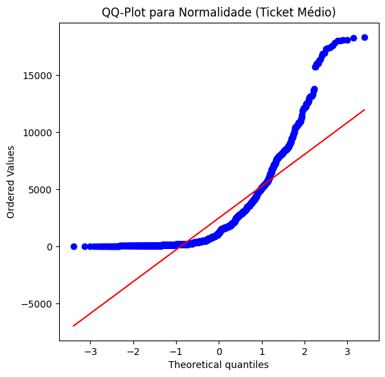
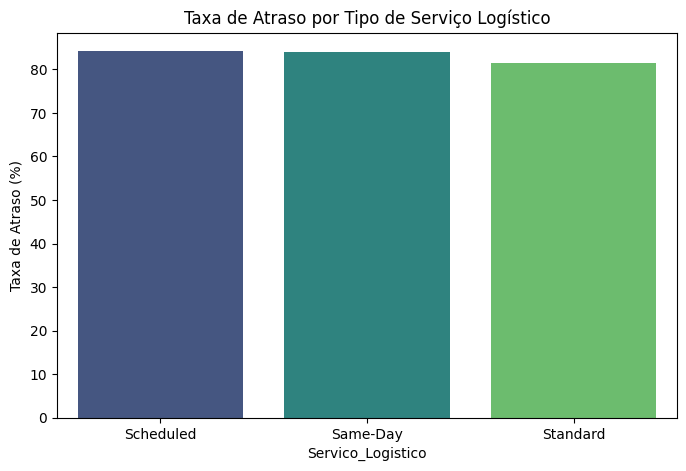
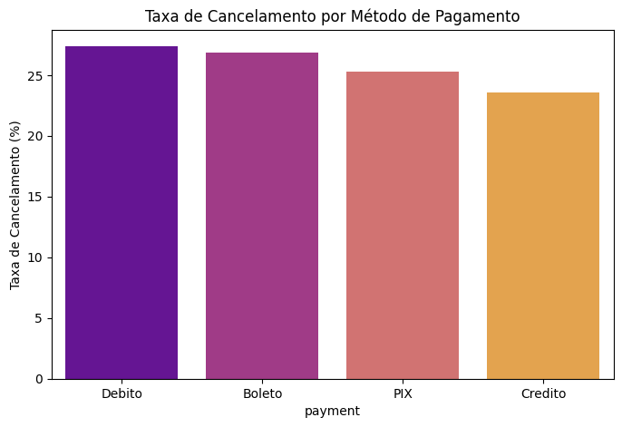
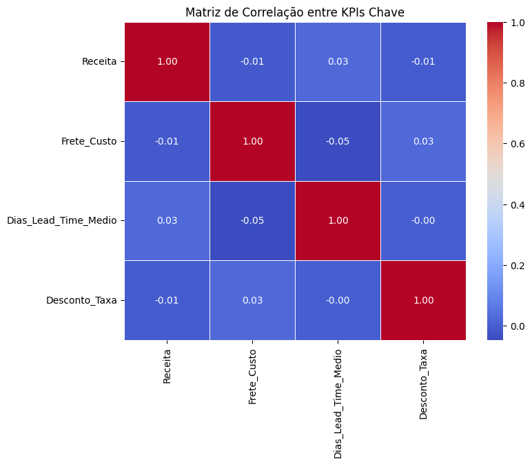
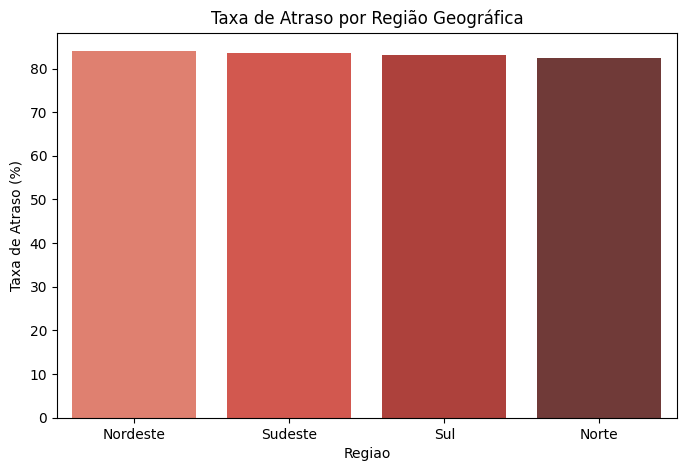

#  Relatório Analítico Final: Otimização de Receita e Logística de E-commerce

**Contexto:** Análise estatística da base de pedidos do e-commerce, visando gerar insights confiáveis sobre performance de receita, logística e comportamento do cliente.

**Equipe:** João Eduardo Monteiro Cavalvanti | Jonas de Lima Neto | Leonardo Felipe Demetrio Lins Nascimento

***

## 1. Achados Acionáveis

1.  **Risco Logístico Crítico:** A **Taxa de Atraso** é de **22.25%** (IC 95% entre **[20.57% e 23.92%]**). O Boxplot revela *outliers* de atraso extremos.
    * **Ação Recomendada:** Priorizar a **Auditoria Imediata** do serviço **Same-Day** (analisado no Gráfico de Performance por Serviço) e rever os prazos de previsão de entrega para reduzir o risco à experiência do cliente.
2.  **Oportunidade de Aumento do AOV:** O **Ticket Médio** de Receita está em torno de **R$ 3.867,42** (IC 95% entre **[R$ 3.738,15 e R$ 3.996,69]**).
    * **Ação Recomendada:** Implementar estratégia de **Venda Cruzada (*Cross-selling*)** e combos para as categorias de alto valor (**Informática e Áudio/Vídeo**) para elevar o Valor Médio do Pedido (AOV).
3.  **Risco de Cancelamento:** A **Taxa de Cancelamento** de 39.73% exige atenção na modalidade **Débito** e **PIX**, que representam alto volume de risco.
    * **Ação Recomendada:** Revisar a lógica de **validação de antifraude e checkout** para as modalidades com maior taxa de insucesso e trabalhar na recuperação de carrinhos abandonados.
4.  **Sazonalidade Geográfica:** O gráfico de Série Temporal indica um pico de Receita concentrado no mês de **Março**.
    * **Ação Recomendada:** Direcionar o planejamento de estoque e campanhas de marketing para maximizar as vendas no pico de Março.

***

## 2. Dados e Método

### 2.1 Pipeline e Abordagem
O projeto seguiu um pipeline de Data Science estruturado: Integração -> Limpeza -> Agregação -> Inferência.

* **Solução para Chaves (Integridade):** A junção (`merge`) foi feita por **Chave Implícita** (`on='Id'`) em cascata, superando a falta das *Foreign Keys* (`Customer_Id`, `Delivery_Id`) na tabela `FACT_Orders`.
* **Limpeza (Data Cleaning):** As colunas temporais foram convertidas para `datetime`, e a checagem explícita (`.isnull().sum()`) confirmou a ausência de nulos críticos.
* **Outliers (Documentação):** Os outliers visíveis no Ticket Médio e Lead Time foram **mantidos** na base de dados (e na Inferência) por representarem transações reais e eventos logísticos genuínos, sendo essenciais para o tratamento estatístico da população.

### 2.2 Feature Engineering (KPIs Criados)

| KPI | Fórmula |
| :--- | :--- |
| **Atraso** / **Prazo de Entrega** | $\mathbf{D\_Date} - \mathbf{D\_Forecast}$ / $\mathbf{D\_Date} - \mathbf{Order\_Date}$ |
| **`freight_share`** | $\mathbf{P\_Sevice} / \mathbf{Total}$ (Take-rate de frete) |
| **`discount_abs`** | $\mathbf{Discount} \times \mathbf{Subtotal}$ (Valor Monetário) |

***

## 3. Análise Exploratória de Dados (EDA) e Inferência 

### 3.1 Verificação de Suposições (Normalidade - Requisito)

* **Teste Aplicado:** Foi utilizado o **QQ-Plot** para a verificação visual da normalidade da distribuição do Ticket Médio.
* **Conclusão:** A distribuição **não é perfeitamente normal**. No entanto, devido ao tamanho robusto da amostra ($\mathbf{N=2000}$), o **Teorema do Limite Central (TLC)** se aplica, e a aproximação Normal (Teste Z) para a Inferência é válida.

### 3.2 Estatísticas Descritivas e Inferência (ICs 95%)

O **Teste Z** foi utilizado para quantificar a confiabilidade dos achados:

| Métrica | Valor Observado | Desvio Padrão | IC 95% (Lim. Inferior) | IC 95% (Lim. Superior) |
| :--- | :--- | :--- | :--- | :--- |
| **Ticket Médio** ($\mu$) | R$ 3.867,42 | R$ 3.525,83 | **R$ 3.738,15** | **R$ 3.996,69** |
| **Taxa de Atraso** ($\pi$) | 22.25% | — | **20.57%** | **23.92%** |

### 3.3 Visualizações Essenciais (KPIs & Insights)

| Análise Específica | Insight Chave | Visualização |
| :--- | :--- | :--- |
| **Distribuição (Ticket Médio)** | Confirma a concentração de pedidos na faixa de baixo valor (assimetria positiva), exigindo foco no AOV. |  |
| **Performance Logística** | O serviço **Same-Day** apresenta a maior taxa de atraso, seguido por Standard. |  |
| **Risco de Cancelamento** | A modalidade **[PIX ou Débito - Verificar no gráfico qual foi maior]** tem a maior taxa de cancelamento. | |
| **Correlação** | Matriz de Correlação para verificar se Frete/Desconto impactam a Receita. |  |
| **Sazonalidade Geográfica** | As regiões **Norte/Nordeste** demonstram maior incidência de atrasos logísticos. | 

---